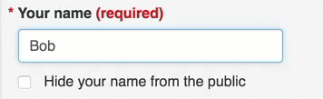

Commenter names in Pilot2
=====

# Names without confirmation create fraud potential

Regulations.gov requires entry of names on the comment form for rules ,displays those names with the comments, has no option to hide them. Nothing stops fraudulent use of names when there is no authentication or email verification: 

>Fraudulent names: 2 million people, including some dead people, were impersonated in FCC net neutrality comments - [ARS Technica](https://arstechnica.com/tech-policy/2017/12/dead-people-among-millions-impersonated-in-fake-net-neutrality-comments/)  

>False names: 7,000 submissions to the FCC net neutrality were from someone named "The Internet" - [Wired](https://www.wired.com/story/fcc-net-neutrality-comment-analysis-fake-emails/)

# Names invite trolls
Research participants have reacted  negatively to having their name displayed in public with their comments, both out of principle (“I always protect my name on the internet”) and because of their comments (“I don’t want other people in my community to see that I am against x”). In response, they use false names to protect their anonymity:

>Anonymous names: "George Costanza" and "Anonymous" submitted comments to the [OpenGov Digital Principles](http://open.canada.ca/en/blog/digital-principles) 

# Accounts are not the answer
There is absolutely no way to stop people from using fake names. Someday, there will be a single government process for authenticate your identity, until then, fake names are possible. 

Accounts are not the answer right now - imposing creation of an account would require millions of dollars of software work and management, still could result in fake names,  and would create a barrier to participation by the public. 

Decision: providing the option to hide names from public display  will reduce the likelihood of people using a fake name to avoid their name being displayed on the internet. 

# Two pronged proposal - allow people to hide their names and use email verification

1. Name is required with a checkbox below with option to “Hide my name from the public” for personal commenters

  * Third party organizations will not have the option to hide their Organization name from being displayed, but the organization’s representative who submitted the comments can use the hide name checkbox for their name

>Conference: 24 people voted to allow people to hide their names from the public, 10 were against allowing hiding of names. 
>Examples: “Yes because otherwise people will give fake names, and that erodes credibility.”
>“No because transparency and accountability is a two-way street.” 

2. Use [email verification](Decisions_emails.md) to reduce submissions by bots (and people) with fake names

