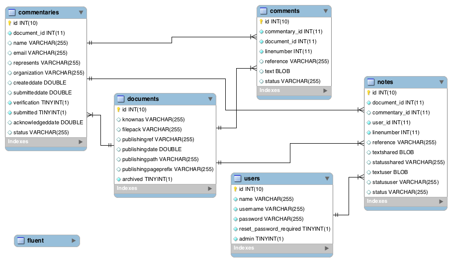
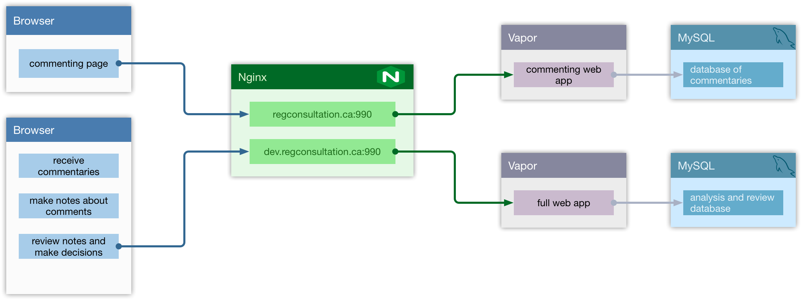

# Pilot 1  Regulatory Consultation 

Prototype development area for regulations and consultations using the Web Experience Toolkit (WET)
 - direct edits in gh-pages branch where you will find all the files.

Live consultation pilot closed on May 18th 2017 - 
https://regconsultation.ca:990/rp-pr/p1/2017/2017-03-04/html/reg2-eng.html

Gazette page with link to (now closed) consultation with pilot link: http://www.gazette.gc.ca/rp-pr/p1/2017/2017-03-04/html/reg2-eng.php#rias

Site for demos now that consultation is closed: https://dev.regconsultation.ca:8080/

Login to Pilot1 demo analyst toolkit (requires account) https://dev.regconsultation.ca:8080/admin/login

## Learning

[What we learned - presented at CFR Conference December 2017](Open_Workshop_CFR_12Dec2017.pdf)

Link to case study by ML Prothko when published

Lisa Fast talks about small failures and learning from Minimum Viable Product iterations https://www.linkedin.com/pulse/government-minimum-viable-product-learning-from-small-lisa-fast

Steve Hume talks innovation and the technology choices for Pilot 1 https://vation.ca/post/2017/why-swift/

18F's Notice and Comment pilot: https://eregs.github.io/features/notice-and-comment/

* Final report on Notice & Comment pilot learning: https://github.com/18F/epa-notice/files/548513/FinalDemo-Phase3UserResearchFindings.pdf

## Architecture

Data Model for Pilot 1

Components map 

