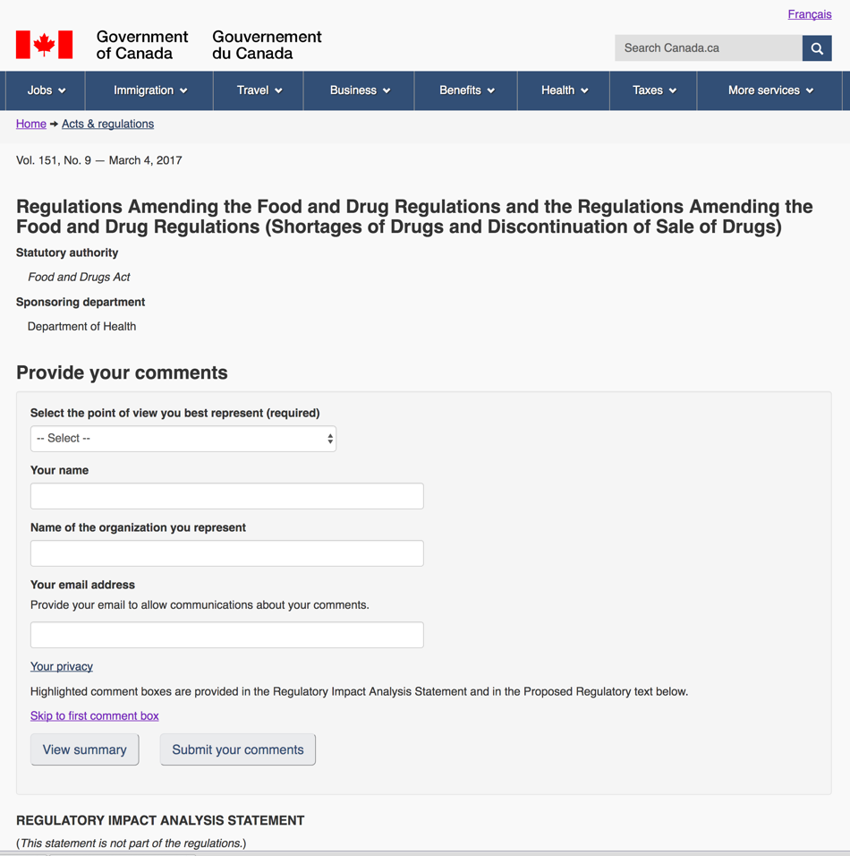

# Pilot 1  Regulatory Consultation 

Prototype development area for regulations and consultations using the Web Experience Toolkit (WET)
 - direct edits in gh-pages branch where you will find all the files.

Gazette page with link to (now closed) bilingual consultation with pilot link: http://www.gazette.gc.ca/rp-pr/p1/2017/2017-03-04/html/reg2-eng.php#rias

User-centred design - iterative design research sessions were held with reps from stakeholder associations and after the launch, detailed co-design workshops with the regulatory team at Health Canada for the process of accepting, analyzing, decisions and review. 

## Learning

[What we learned - presented at CFR Conference December 2017 (PDF)](Open_Workshop_CFR_12Dec2017.pdf)

Link to case study by ML Prothko when published

Lisa Fast talks about small failures and learning from Minimum Viable Product iterations https://www.linkedin.com/pulse/government-minimum-viable-product-learning-from-small-lisa-fast

Steve Hume talks innovation and the technology choices for Pilot 1 https://vation.ca/post/2017/why-swift/

USA: 18F's Notice and Comment pilot: https://eregs.github.io/features/notice-and-comment/

* Final report on 18F Notice & Comment pilot learning: https://github.com/18F/epa-notice/files/548513/FinalDemo-Phase3UserResearchFindings.pdf

CFR eRegs Pilot team honored with Deputy Minister's Award for Excellence in the category of Innovation and Creativity on June 15th, 2018

## Architecture

Data Model for Pilot 1

Components map 

# Screenshots of commenter view

Commenter view of top of regulatory proposal

Commenter adding a comment - Save button was added for commenter confidence - auto-saves 

# Screenshots of analyst view after sign-in

Receive view

Commentary view - all submissions - names of submitters are blurred

View by comment - list of all comments by document section

Adding a note

Review comments for a particular section with the section of regulatory text visible

