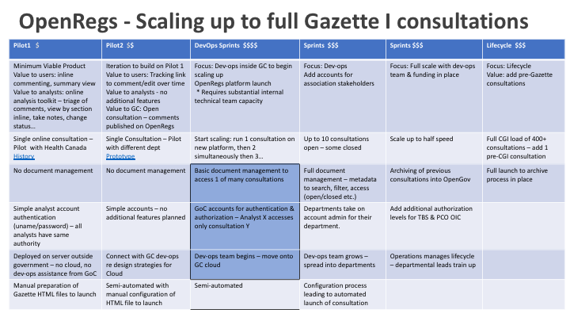
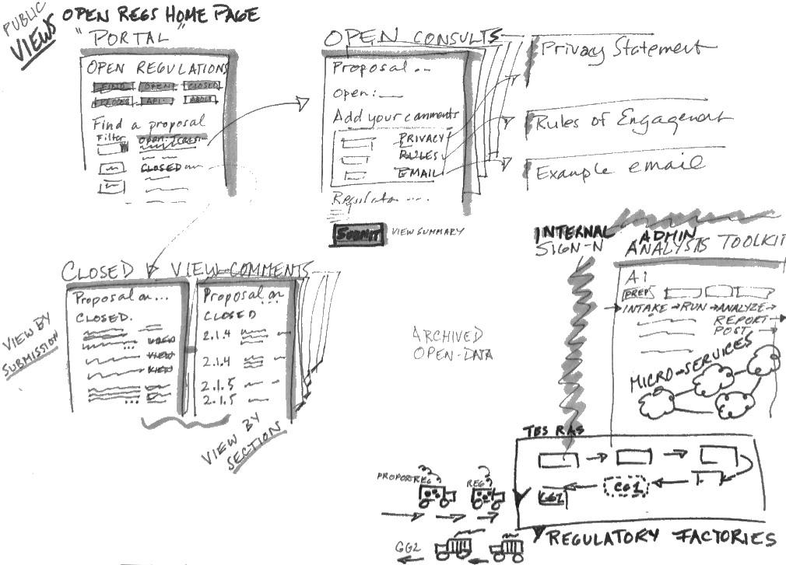
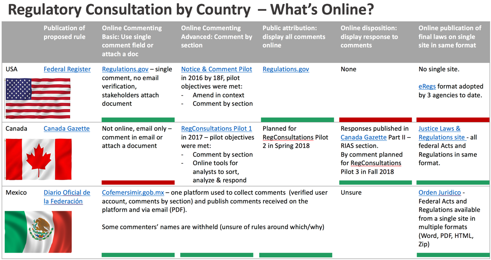

eRegs Pilot2 project
=====

Planning and design preparations for second pilot of online regulatory consultations. 

Pilot1 MVP: 1st online consultation with inline commenting on the regulatory proposal and an admin/analysis toolkit for the regulatory team to prepare, receive, analyze and review comment submissions

* Code base for Pilot1 is in this repository
* [History, posts, architecture and demo links for Pilot1](./Pilot1_history.md)

Pilot2 MVP: 2nd consultation pilot of a regulatory proposal with new functionality of public display of all comments from Open Regulations Platform 

* [Prototype of eRegulations site - home page](https://vation-ca.github.io/p2protos/p2openregs.html)
* [Prototype of example consultation with privacy, email, rules etc.](https://vation-ca.github.io/p2protos/p2form-1-en.html)
* [Prototype of view public comments for an example consultation](https://vation-ca.github.io/p2protos/p2view-subs-en.html)

## Design decisions with policy implications

   
* Commenters can hide their personal name from public view 
  * [Background on decision to hide personal names](Decisions_names.md) 
* Commenters must verify their email address before their submission is accepted
  * [Background on decision to verify email addresses](Decisions_emails.md)
* Display comments publicly at the end of consultation period, not during the consultation 
  * [Background on decision to display comments after the consultation period](Decisions_timing.md)
* Format of display of submissions - by submission and by text section, or just by submission
* No exceptions to public comment display, all submissions - whether submitted online, by email or by snail mail -  are displayed online.
* No parallel process - all submissions are channelled online - no email submissions will be accepted for the pilot consultation.

## Iteration plan (draft)

[Download Iteration plan 16March2018 (PPT)](Iteration_plan_16March2018.ppt)

## Sketch of Open Regulations public views

## Compare Canada - US - Mexico regulatory platforms

